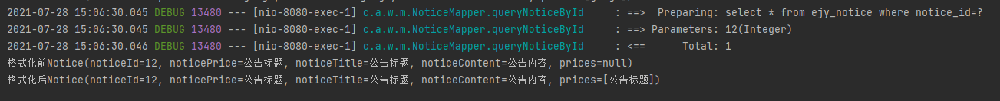
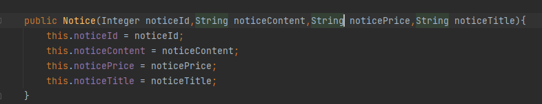
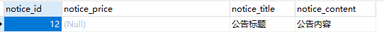
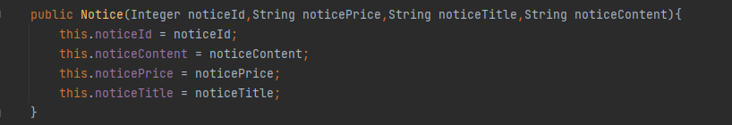

# 遇到的问题
在用mybatis查询数据时，明明数据中没有数据却被同一行的其他属性赋值，具体情节如下所示：

idea错误输出

错误实体类
# 解决方案
如上图所示，经过debug调试发现,mybatis获取的数据就是错误数据，但用相同的sql语句在数据库中就正确获得。
问题出在哪里呢？mybatis从数据库中获取到数据后，经过构造实体类产生想要的结果，问题就在 实体类中的构造函数和数据库中字段顺序的不一致上。
数据表中的数据如下所示：

构造函数的正确写法：

# 总结
java构造函数一定要注意各个参数是否与传入值预期一致